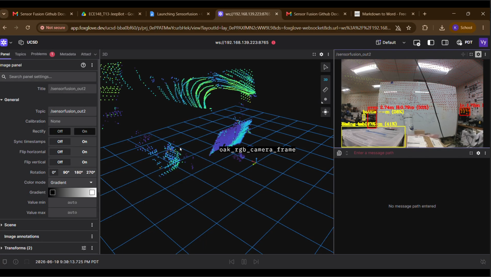

# 🤖 Team 13 - LiDAR Integration on JeepBot & Dropoff System
### ECE/MAE 148 · Spring 2026 · UC San Diego

 

> Sensor fusion pipeline combining an **OAK-D Pro** camera and **Livox MID-360 LiDAR** with YOLO-based object detection, distance estimation, and a servo-actuated autonomous dropoff mechanism - running on a **Raspberry Pi 5**.



---
 
## 📋 Table of Contents
 
1. [Team Members](#-team-members)
2. [Abstract](#-abstract)
3. [What We Promised](#-what-we-promised)
4. [Accomplishments](#-accomplishments)
5. [Challenges & Lessons Learned](#-challenges--lessons-learned)
6. [Video Demo & Photos](#-video-demo--photos)
7. [Sensor Fusion on the JeepBot - How To](#-sensor-fusion-on-the-jeepbot--how-to)
8. [Hardware - Dropoff System](#-hardware--dropoff-system)
9. [Gantt Chart](#-gantt-chart)
---
 
## 👥 Team Members
 
| Name | Major | Contacts | LinkedIn |
|---|---|---|---|
| Edgar Stalleicken | MAE |
| Abdulmajeed Altamimi | MAE |
| Riku Nagareda | ECE |
| Vy Dang | CSE | kid002@ucsd.edu or kietdangvy@gmail.com | [LinkedIn](https://www.linkedin.com/in/kiet-vy-dang-45a419201/)
 
---
 
## 📄 Abstract
 
Team 13 developed two interconnected systems for the JeepBot autonomous platform. The first is a **sensor fusion pipeline** that integrates the Livox MID-360 LiDAR with the OAK-D Pro camera and YOLO object detection, ported from a Jetson AGX architecture to a Raspberry Pi 5 with AI Hat. The second is a **servo-actuated autonomous dropoff mechanism** - a box that pitches via a gear-rack motor drive and releases a gate via servo, designed in SolidWorks with full mechanical validation.
 
---
 
## 📌 What We Promised
 
### Must-Haves
- [x] Physically build the Box and Plate for the Dropoff System
- [x] Transfer current LiDAR progress onto the JeepBot
- [x] Demonstrate a functional release/drop-off action with a designed pitching and latch-opening mechanism in CAD
### Nice-to-Haves
- [x] Algorithm for classification based on collected LiDAR data
- [ ] Make dropoff trigger based on LiDAR classification (e.g., human recognized → stop + drop)
- [ ] Full obstacle avoidance
- [ ] Optimized materials for weight and torque
---
 
## Accomplishments
 
- **Ported the Sensor Fusion pipeline** from a CSE team's Jetson AGX to the JeepBot's Raspberry Pi 5 + AI Hat (special thanks to Jingting and Borna)
- **Combined and launched** the Sensor Fusion node with YOLO detection for object classification, distance estimation, and confidence value output
- **Validated the system** through live demonstrations of YOLO-based object detection with bounding boxes, labels, and distance readouts on the camera feed
- **Designed and built** the Dropoff Mechanism - CAD documentation covers both the pitching (gear-to-gear rack) and the latch-opening (servo-actuated) mechanisms
- **Collaborated** with Team 12 and DSC 190 for smooth hardware/model integration
### LiDAR Pipeline Details
 
| Stage | Description |
|---|---|
| **Setup** | Livox MID-360 via `livox_ros_driver2` in Docker, 100 ms window, ~20k points/frame |
| **Preprocessing** | Rotate cloud to correct tilt, remove ground via RANSAC, filter 0.5 m–15 m |
| **Clustering** | Two distance rings (0–5 m and 5 m+), DBSCAN per ring with tighter params up close |
| **Tracking** | Nearest-centroid matching across frames, Kalman filter smoothing, 3-frame track persistence |
| **Classification** | Label by bounding box dimensions and point density; confirm after 3 stable frames |
| **Avoidance** | Inflate boxes by label (0.3 / 0.8 / 1.0 m), project dynamic obstacles forward, stop at 0.5 m |
 
---
 
## Challenges & Lessons Learned
 
| Issue | How We Addressed It | Lesson |
|---|---|---|
| Firmware incompatibility (Jetson AGX --> RPi 5) | Agentic coding + prompt engineering + architecture understanding | Platform migration is a real engineering skill - not trivial |
| Workflow dependencies on other teams | Shifted to alternative tasks; built in fallback planning | Start early, don't depend on upstream progress, build for the idealistic but plan for the realistic |
| Hardware assembly blocked by missing parts | Explored makerspace tooling early; pivoted design iterations | Assess construction limitations before finalizing design |
| Lighting variability breaking camera tracking | Shifted reliance to LiDAR + GPS for navigation | Sensor redundancy is key for robust outdoor autonomy |
 
### What Did Not Work
- **Physical assembly and construction** of the Dropoff System - unforeseen parts unavailability at the DIB Makerspace, combined with time consumed debugging the sensor fusion pipeline, prevented completion of the physical build.
### If We Had Another Week
- Implement **Forward Collision Avoidance** based on time-to-collision (TTC):
```python
  if time_to_collision < SAFETY_THRESHOLD:
      action = "EMERGENCY STOP"
```
- Add **password or facial recognition** to the dropoff gate to prevent theft
- Deploy **obstacle avoidance** using a sim-to-real approach with the `gpiozero` module
- **Complete the physical Dropoff System** - wire up servo and motor per CAD documentation
---
 
## 🎥 Video Demo & Photos
 
[YouTube for Sensor Fusion demo](https://youtu.be/OATsJNGTlzQ)

 
Key demonstrations:
- Live YOLO object detection feed with bounding boxes, class labels, and distance estimates
- Dropoff system CAD renders: full front view, side view, and mounted-on-trunk view
- 3D motion study of the gear-rack pitching mechanism and servo-actuated latch
---
 
## 🛠️ Sensor Fusion on the JeepBot - How To
 
### `sensorfusion_ws` - Sensor Fusion Workspace
 
Unified workspace for the **OAK-D Pro + Livox MID-360** sensor fusion pipeline.
Includes a CPU-only Raspberry Pi 5 path under `fusion/docker_rpi5` for running fusion nodes without CUDA or Jetson L4T.
 
### Quick Start (Raspberry Pi 5)
 
```bash
# 1. Build all Docker images
bash ~/sensorfusion_ws/shared/build_all.sh
 
# 2. Configure LiDAR Ethernet (one-time; requires LiDAR cable connected)
sudo bash ~/sensorfusion_ws/shared/setup_livox_network.sh eth0 192.168.1.50
 
# 3. Launch the full stack (camera + LiDAR + fusion + Foxglove)
bash ~/sensorfusion_ws/shared/start_all_rpi5.sh <sensor-id>
```
 
> Replace `<sensor-id>` with the last two digits of your Livox MID-360 serial number (e.g. `50` → sensor IP `192.168.1.150`).
 
Connect Foxglove Studio to `ws://<pi-wifi-ip>:8765`.
 
📖 Full step-by-step guide: [`shared/docs/PI5_LAUNCH_GUIDE.md`](shared/docs/PI5_LAUNCH_GUIDE.md)
 
---
 
### YOLO + Cone Detection Mode
 
```bash
# MAE/ECE 148 Spring 2026 - full detection stack
SENSORFUSION_DETECTION_BACKEND=cpu FUSION_MODE=detection \
  bash ~/sensorfusion_ws/shared/start_all_rpi5.sh 192.168.1.3
```
 
### Stop All Nodes (Recommended)
 
```bash
FUSION_MODE=detection bash ~/sensorfusion_ws/shared/stop_all_rpi5.sh 192.168.1.3
```
 
---
 
## ⚙️ Hardware - Dropoff System
 
### Design Overview
 
The dropoff mechanism consists of two independently actuated subsystems:
 
**Pitching Mechanism**
- The box pitches around a front-mounted axis driven by an electric motor
- A **gear-to-gear rack** connection ensures a consistent pitch angle every actuation
- Modular design allows easy assembly and disassembly
**Latch / Gate Mechanism**
- Gate is controlled directly by a **servo** attached to the latch's pitch axis
- Closed position is 90° (maximum torque) to securely hold the gate shut
- Opens on command when drop condition is met
### Hardware Status
 
- [x] Parts designed and validated in SolidWorks (static + dynamic force analysis)
- [x] Latch-opening mechanism designed
- [x] Pitching mechanism designed
- [x] Servo placement and pitching gear designed
- [x] Mechanical forces calculated
- [ ] Physical assembly (pending - parts availability)
### Practical Applications
 
| Civil Use | Dual-Use |
|---|---|
| Small package delivery | GPS antenna dropping |
| Food delivery | Medicaid kit delivery |
| Medical delivery (EpiPen, antibiotics) | Ammo delivery |
 
---
 
## 📅 Gantt Chart
 
```
Week →         19     20     21     22     23     24
─────────────────────────────────────────────────────────
Electronics Assembly   ██████
Building a Model              ██████
Model Training                       ██████
Integrating Sensor Data               ██████
UX / Prototype                               ██████
─────────────────────────────────────────────────────────
LiDAR Pipeline Transfer  ██████████████
Hardware (Box) Assembly                ████████████
Testing & Debugging                          ████████
Submission                                         ██
Project End                                        ▲
```
 
> Note: Due to makerspace part availability and sensor fusion debugging, hardware assembly was delayed relative to the original plan.
 
---
 
## 🔗 References & Credits
 
- Special thanks to **Jingting** and **Borna** for foundational sensor fusion work on the Jetson AGX
- Collaboration with **Team 12** and **DSC 190** for model integration and system interfaces
- Course: ECE/MAE 148, UC San Diego, Spring 2026
 

